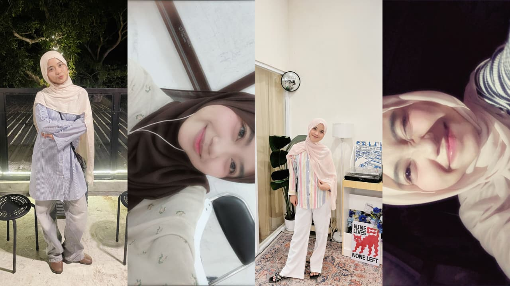

 
 

<h1 align="center">🌿 Hi, I'm Natasya!</h1>

  

  <i>"Coding my way through growth, creativity, and calm energy."</i>

---

## 🌱 About Me

- 🎓 Information Systems student at **Universitas Hasanuddin**
- 💻 Passionate about **Web Development** and **UI/UX Design**
- 🌍 Aspiring to create impactful digital experiences on an **international scale**
- 🎬 Member of **Liga Film Mahasiswa**
- 💡 Member of **GDGOC (Google Developer Group on Campus)**
- ✨ Motto: *"Be brave to start, finish, and let go."*

---

## 💻 Programming Languages

  

---

## ⚙️ Tech Stack

  

---

## 📊 GitHub Stats

  
  

---

## 🌐 Connect With Me

---

🍃 <i>"Growing through every line of code"</i> 🍃

